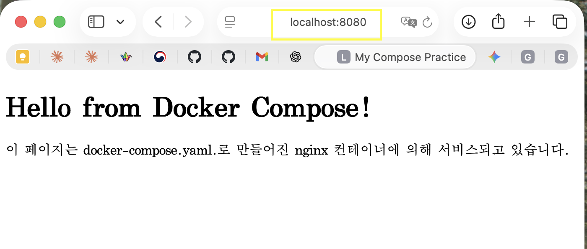
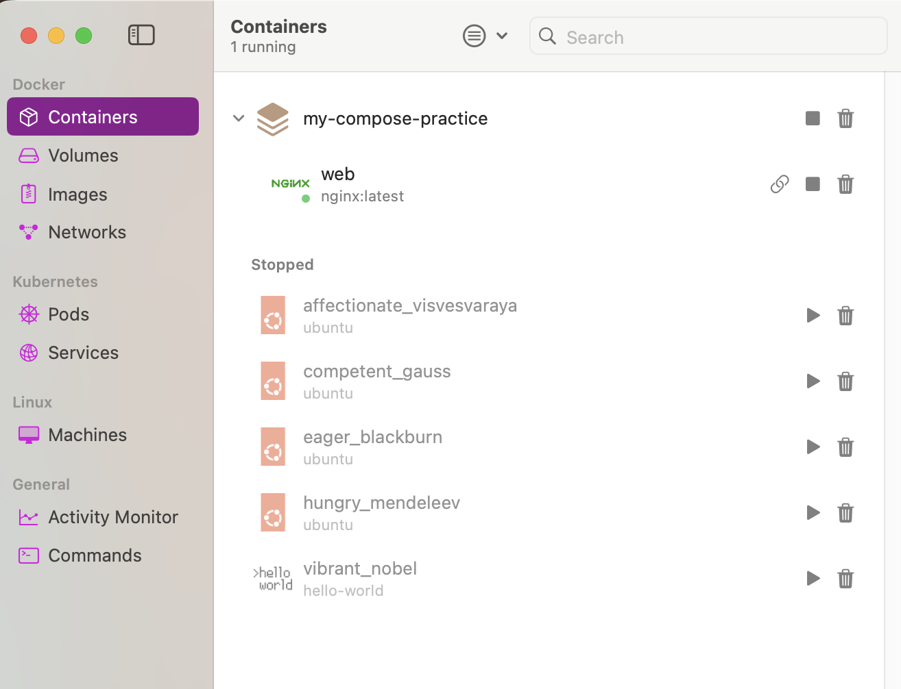

#  보너스 과제!!!


## 1. Docker Compose
- `docker-compose.yml`의 기본 구조를 학습하고, 단일 서비스를 Compose로 실행해 보기

### 1-1. Docker Compose란?
- YAML 파일에 컨테이너 실행 설정을 적어두고, 그 설정대로 여러 개의 컨테이너를 한 번에 실행하는 방식
- Docker 공식 문서도 Compose를 서비스, 네트워크, 볼륨을 묶어서 관리하는 도구(YAML 기반 설정 파일)로 설명하고 있다.
- 기본 파일명은 `compose.yaml`이며, `docker-compose.yml`도 허용한다.
    - docker run은 한번 치고 지나가는 명령이고, Compose는 **재현 가능한** 실행 설정 문서라는 것.

Docker Compose가 있음으로 편해지는 것은:
1. 명령어를 기억할 필요가 줄어든다는 것. 매번 ```docker run -d -p 8080:80 -v $(pwd)/html:/usr/share/nginx/html --name webserver nginx``` 같은 걸 치다 보면 손가락 관절이든 기억력이든 한 쪽이 먼저 증발하게 될 것이다.
2. 팀원도, 낯선 github 방문자도 같은 환경을 재현할 수 있다는 것. ```docker compose up -d``` 한 번이면 끝. 
3. 포트/볼륨/환경변수 같은 설정치와 그 변경을 한 눈에 볼 수 있다는 것. 미리 정해놓았고 그걸 또 기록해놓았으므로 어떤 환경에서 무엇으로 실행했는지 혼란에 빠지는 일도, 딴짓하다가 포트 겹치는 일도 방지할 수 있다.
4. 다중 컨테이너로 확장하기가 쉽다. 실습 같은 레벨에서는 nginx 하나 정도 실행하고 말겠지만, 실제로 프론트엔드/백엔드/DB/캐시/메시지큐 등등을 띄워야 할 때는 docker run을 일일이 치는 것은 상상만 해도 끔찍하다. Compose를 쓰면 모든 셋업을 한 파일에 정리해놓고 ```docker compose up -d``` 한 번만 치면 된다. 사실 이게 Compose가 만들어진 이유이기도 하다.

### 1-2. docker-compose.yml의 얼개
현재 레벨에서 필요한 골격은 다음과 같다.
```yaml
services:
  서비스이름:
    image: 사용할이미지
    container_name: 컨테이너이름
    ports:
      - "호스트포트:컨테이너포트"
    volumes:
      - 호스트경로:컨테이너경로
    environment:
      - 변수이름=값
```
Compose의 최상위 핵심은 `services`가 되고, 그 아래에 내가 띄우고 싶은 컨테이너들을 정의하는 것이다.


### 1-3. 단일 Compose 실습
우선 다음과 같은 구조를 가져가보자.

```bash
my-compose-practice/
├─ compose.yaml
└─ html/
   └─ index.html
```
이렇게 만들 수 있다.
```bash
jingeollee@Jingeolui-MacBookPro Phase_10_Bonus % mkdir my-compose
-practice
jingeollee@Jingeolui-MacBookPro Phase_10_Bonus % cd my-compose-practice
jingeollee@Jingeolui-MacBookPro my-compose-practice % touch compo
se.yaml
jingeollee@Jingeolui-MacBookPro my-compose-practice % mkdir html
jingeollee@Jingeolui-MacBookPro my-compose-practice % touch html/
index.html
```
`html/index.html`에 들어가는 내용은 다음과 같다.
```html
<!DOCTYPE html>
<html lang="ko">
<head>
    <meta charset="UTF-8">
    <title>My Compose Practice</title>
</head>
<body>
    <h1>Hello from Docker Compose!</h1>
    <p>이 페이지는 docker-compose.yaml.로 만들어진 nginx 컨테이너에 의해 서비스되고 있습니다.</p>
</body>
</html>
```
`compose.yaml`에 들어가는 내용은 다음과 같다.
```yaml
services:
  web: #서비스 이름
    image: nginx:latest #nginx:최신 버전 이미지 사용한다는 이야기
    container_name: compose-nginx #컨테이너 이름
    ports: #외부에서 8080 포트로 접속하면 컨테이너 내부 80 포트랑 연결시키겠다는 이야기
      - "8080:80"
    volumes: #호스트의 ./html 폴더를 컨테이너 내부의 /usr/share/nginx/html 폴더에 연결한다는 이야기
      - ./html:/usr/share/nginx/html
```
이제 실행하려면 `my-compose-practice`폴더에 들어가서 `docker compose up` 을 입력해보면 된다. 실습해 보자.
``` bash
jingeollee@Jingeolui-MacBookPro my-compose-practice % docker comp
ose up 
[+] Running 8/8
 ✔ web Pulled                                               7.6s 
   ✔ 53196b1f47bd Pull complete                             2.9s 
   ✔ a29392f5ea40 Pull complete                             3.3s 
   ✔ 51fdf39f7d52 Pull complete                             3.3s 
   ✔ 4acdeb3d572c Pull complete                             3.3s 
   ✔ 338f85c9c2a7 Pull complete                             4.2s 
   ✔ 242462ae7f31 Pull complete                             4.2s 
   ✔ c05cfe535fc7 Pull complete                             4.2s 
[+] Running 2/2
 ✔ Network my-compose-practice_default  Created             0.0s 
 ✔ Container compose-nginx              Created             0.1s 
Attaching to compose-nginx
compose-nginx  | /docker-entrypoint.sh: /docker-entrypoint.d/ is not empty, will attempt to perform configuration
compose-nginx  | /docker-entrypoint.sh: Looking for shell scripts in /docker-entrypoint.d/
compose-nginx  | /docker-entrypoint.sh: Launching /docker-entrypoint.d/10-listen-on-ipv6-by-default.sh
compose-nginx  | 10-listen-on-ipv6-by-default.sh: info: Getting the checksum of /etc/nginx/conf.d/default.conf
compose-nginx  | 10-listen-on-ipv6-by-default.sh: info: Enabled listen on IPv6 in /etc/nginx/conf.d/default.conf
compose-nginx  | /docker-entrypoint.sh: Sourcing /docker-entrypoint.d/15-local-resolvers.envsh
compose-nginx  | /docker-entrypoint.sh: Launching /docker-entrypoint.d/20-envsubst-on-templates.sh
compose-nginx  | /docker-entrypoint.sh: Launching /docker-entrypoint.d/30-tune-worker-processes.sh
compose-nginx  | /docker-entrypoint.sh: Configuration complete; ready for start up
compose-nginx  | 2026/04/07 08:11:08 [notice] 1#1: using the "epoll" event method
compose-nginx  | 2026/04/07 08:11:08 [notice] 1#1: nginx/1.29.7
compose-nginx  | 2026/04/07 08:11:08 [notice] 1#1: built by gcc 14.2.0 (Debian 14.2.0-19) 
compose-nginx  | 2026/04/07 08:11:08 [notice] 1#1: OS: Linux 6.17.8-orbstack-00308-g8f9c941121b1
compose-nginx  | 2026/04/07 08:11:08 [notice] 1#1: getrlimit(RLIMIT_NOFILE): 20480:1048576
compose-nginx  | 2026/04/07 08:11:08 [notice] 1#1: start worker processes
compose-nginx  | 2026/04/07 08:11:08 [notice] 1#1: start worker process 29
compose-nginx  | 2026/04/07 08:11:08 [notice] 1#1: start worker process 30
compose-nginx  | 2026/04/07 08:11:08 [notice] 1#1: start worker process 31
compose-nginx  | 2026/04/07 08:11:08 [notice] 1#1: start worker process 32
compose-nginx  | 2026/04/07 08:11:08 [notice] 1#1: start worker process 33
compose-nginx  | 2026/04/07 08:11:08 [notice] 1#1: start worker process 34
compose-nginx  | 2026/04/07 08:11:08 [notice] 1#1: start worker process 35
compose-nginx  | 2026/04/07 08:11:08 [notice] 1#1: start worker process 36
compose-nginx  | 2026/04/07 08:11:08 [notice] 1#1: start worker process 37
compose-nginx  | 2026/04/07 08:11:08 [notice] 1#1: start worker process 38
compose-nginx  | 2026/04/07 08:11:08 [notice] 1#1: start worker process 39
compose-nginx  | 2026/04/07 08:11:08 [notice] 1#1: start worker process 40
compose-nginx  | 2026/04/07 08:11:08 [notice] 1#1: start worker process 41
compose-nginx  | 2026/04/07 08:11:08 [notice] 1#1: start worker process 42
compose-nginx  | 2026/04/07 08:11:08 [notice] 1#1: start worker process 43

```
이제 curl 명령어로 localhost:8080에 접속해 보면

```bash
jingeollee@Jingeolui-MacBookPro codyssey2026 % curl localhost:8080
<!DOCTYPE html>
<html lang="ko">
<head>
    <meta charset="UTF-8">
    <title>My Compose Practice</title>
</head>
<body>
    <h1>Hello from Docker Compose!</h1>
    <p>이 페이지는 docker-compose.yaml.로 만들어진 nginx 컨테이너에 의해 서비스되고 있습니다.</p>
</body>
</html>%                                                                                                  jingeollee@Jingeolui-MacBookPro codyssey2026 % 
```
다음과 같이 잘 동작하는 것을 확인할 수 있다.

웹브라우저에 localhost:8080을 입력해도 동일한 결과를 확인할 수 있다.


참고) 실행되고 있는 컨테이너를 확인하려면 `docker ps` 명령어를 입력하면 된다.
```bash
jingeollee@Jingeolui-MacBookPro codyssey2026 % docker ps
CONTAINER ID   IMAGE          COMMAND                   CREATED         STATUS         PORTS                                     NAMES
99fc41bd1910   nginx:latest   "/docker-entrypoint.…"   4 minutes ago   Up 4 minutes   0.0.0.0:8080->80/tcp, [::]:8080->80/tcp   compose-nginx
jingeollee@Jingeolui-MacBookPro codyssey2026 % 
```
다음과 같이 나온다. 
같은 것을 Orbstack에서 확인하면

다음과 같이 나온다.

우선 컨테이너를 정지하고 나오기 위해서 Ctrl + C를 눌러보자.
```bash
compose-nginx  | 2026/04/07 08:22:06 [notice] 1#1: worker process 39 exited with code 0
compose-nginx  | 2026/04/07 08:22:06 [notice] 1#1: exit
 Container compose-nginx  Stopped
compose-nginx exited with code 0
```
exit code 0(정상종료)가 떴다. 이제 docker ps 및 ps-a로 흔적을 찾아보자.
```bash
jingeollee@Jingeolui-MacBookPro codyssey2026 % docker ps
CONTAINER ID   IMAGE     COMMAND   CREATED   STATUS    PORTS     NAMES
jingeollee@Jingeolui-MacBookPro codyssey2026 % docker ps -a
CONTAINER ID   IMAGE          COMMAND                   CREATED             STATUS                         PORTS     NAMES
99fc41bd1910   nginx:latest   "/docker-entrypoint.…"   13 minutes ago      Exited (0) 2 minutes ago                 compose-nginx
b360b130423d   ubuntu         "bash"                    46 minutes ago      Exited (0) 43 minutes ago                competent_gauss
779482a06e1f   ubuntu         "bash"                    About an hour ago   Exited (0) About an hour ago             hungry_mendeleev
66e12b2ab592   ubuntu         "bash"                    2 hours ago         Exited (0) About an hour ago             eager_blackburn
4ba914dbb7c3   ubuntu         "bash"                    2 hours ago         Exited (127) 2 hours ago                 affectionate_visvesvaraya
b8585581708b   hello-world    "/hello"                  3 hours ago         Exited (0) 3 hours ago                   vibrant_nobel
jingeollee@Jingeolui-MacBookPro codyssey2026 % 
```
`compose-nginx`의 흔적이 보인다. (container는 멈췄지만, network는 그대로 남아있다.)

그럼 docker compose를 완전히 정리하려면?
`docker compose down`을 입력하면 된다.
```bash
jingeollee@Jingeolui-MacBookPro my-compose-practice % docker comp
ose down
[+] Running 2/2
 ✔ Container compose-nginx              Removed             0.0s 
 ✔ Network my-compose-practice_default  Removed             0.1s
```
바로 컨테이너와 네트워크가 흔적까지 싹 지워짐을 확인할 수 있다.

요약하자면:

`docker run`은 컨테이너를 어떻게 실행할 지를 터미널에 한 줄로 입력하는 것이고, 


`docker compose`는 컨테이너를 어떻게 실행할지를 **파일에 적어놓고** 그 파일대로 실행하는 것이다.


## 2. Docker Composes 멀티 컨테이너
- 웹 서버 + (임의의 보조 서비스) 2개 이상을 Compose로 함께 실행하기


학습 포인트: 컨테이너 간 네트워크 통신이 가능한 지 확인하기

## 3. Compose 운영 명령어 습득

- `up` `down` `ps` `logs` 를 사용해서 실행/종료/상태/로그 관리하기
```bash
docker compose up -d
docker compose ps
docker compose logs
docker compose restart
docker compose down
```
다섯개의 명령어를 확인해 보겠다.
### 3-1. `docker compose up -d`
`docker compoase up`은 이미 위에서 사용해 보았다. 다만 -d를 붙임으로써 (detached) 백그라운드에서 실행되도록 하였다. 그냥 `docker compose up`까지만 입력하면 로그 화면이 터미널을 점유하고, 터미널을 빠져나오려면 바로 컨테이너가 정지되었던 것을 기억할 것이다.
실습해보자면:
```bash
jingeollee@Jingeolui-MacBookPro my-compose-practice % docker compose up -d
[+] Running 2/2
 ✔ Network my-compose-practice_default  Created             0.0s 
 ✔ Container compose-nginx              Started             0.1s 
jingeollee@Jingeolui-MacBookPro my-compose-practice % 
```
터미널을 자유롭게 이용할 수 있다.
이어서 다음 명령어들을 확인해 보자.

### 3-2. `docker compose ps`
어떤 서비스가 떠 있는지, 컨테이너가 실행 중인지, 포트 연결이 어떻게 되었는지 보여준다.
```bash
jingeollee@Jingeolui-MacBookPro my-compose-practice % docker compose ps
NAME            IMAGE          COMMAND                  SERVICE   CREATED         STATUS         PORTS
compose-nginx   nginx:latest   "/docker-entrypoint.…"   web       3 minutes ago   Up 3 minutes   0.0.0.0:8080->80/tcp, [::]:8080->80/tcp
```
이제 `docker compose ps -a`를 `docker ps -a`와 비교해 보자.
```bash
jingeollee@Jingeolui-MacBookPro my-compose-practice % docker compose ps -a
NAME            IMAGE          COMMAND                  SERVICE   CREATED         STATUS         PORTS
compose-nginx   nginx:latest   "/docker-entrypoint.…"   web       8 minutes ago   Up 8 minutes   0.0.0.0:8080->80/tcp, [::]:8080->80/tcp
jingeollee@Jingeolui-MacBookPro my-compose-practice % docker ps -a
CONTAINER ID   IMAGE          COMMAND                  CREATED             STATUS                         PORTS                                     NAMES
befbc1b94746   nginx:latest   "/docker-entrypoint.…"   9 minutes ago       Up 9 minutes                   0.0.0.0:8080->80/tcp, [::]:8080->80/tcp   compose-nginx
b360b130423d   ubuntu         "bash"                   About an hour ago   Exited (0) 58 minutes ago                                                competent_gauss
779482a06e1f   ubuntu         "bash"                   About an hour ago   Exited (0) About an hour ago                                             hungry_mendeleev
66e12b2ab592   ubuntu         "bash"                   2 hours ago         Exited (0) 2 hours ago                                                   eager_blackburn
4ba914dbb7c3   ubuntu         "bash"                   3 hours ago         Exited (127) 2 hours ago                                                 affectionate_visvesvaraya
b8585581708b   hello-world    "/hello"                 3 hours ago         Exited (0) 3 hours ago                                                   vibrant_nobel
jingeollee@Jingeolui-MacBookPro my-compose-practice % 

```
docker ps-a는 docker엔진 전체의 모든 컨테이너를 보여주고, `docker compose ps -a`는 현재 compose 프로젝트에 속한 컨테이너만 필터링해서 보여준다. 다른 폴더에서 실행중인 컨테이너는 무시한다.

### 3-3. `docker compose logs`
돌아가는 docker compose의 logs를 본다.
특정 서비스만 보려면 `docker compose logs <service_name>`을 입력하면 된다.

또한 `-f` 옵션을 붙이면 실시간으로 로그를 확인할 수 있다. (follow)

예시로 `docker compose logs -f web` 등을 입력해볼 수 있겠다.

```bash
jingeollee@Jingeolui-MacBookPro my-compose-practice % docker compose logs -f web
compose-nginx  | /docker-entrypoint.sh: /docker-entrypoint.d/ is not empty, will attempt to perform configuration
compose-nginx  | /docker-entrypoint.sh: Looking for shell scripts in /docker-entrypoint.d/
compose-nginx  | /docker-entrypoint.sh: Launching /docker-entrypoint.d/10-listen-on-ipv6-by-default.sh
compose-nginx  | 10-listen-on-ipv6-by-default.sh: info: Getting the checksum of /etc/nginx/conf.d/default.conf
compose-nginx  | 10-listen-on-ipv6-by-default.sh: info: Enabled listen on IPv6 in /etc/nginx/conf.d/default.conf
compose-nginx  | /docker-entrypoint.sh: Sourcing /docker-entrypoint.d/15-local-resolvers.envsh
compose-nginx  | /docker-entrypoint.sh: Launching /docker-entrypoint.d/20-envsubst-on-templates.sh
compose-nginx  | /docker-entrypoint.sh: Launching /docker-entrypoint.d/30-tune-worker-processes.sh
compose-nginx  | /docker-entrypoint.sh: Configuration complete; ready for start up
compose-nginx  | 2026/04/07 08:29:20 [notice] 1#1: using the "epoll" event method
compose-nginx  | 2026/04/07 08:29:20 [notice] 1#1: nginx/1.29.7
compose-nginx  | 2026/04/07 08:29:20 [notice] 1#1: built by gcc 14.2.0 (Debian 14.2.0-19) 
compose-nginx  | 2026/04/07 08:29:20 [notice] 1#1: OS: Linux 6.17.8-orbstack-00308-g8f9c941121b1
compose-nginx  | 2026/04/07 08:29:20 [notice] 1#1: getrlimit(RLIMIT_NOFILE): 20480:1048576
compose-nginx  | 2026/04/07 08:29:20 [notice] 1#1: start worker processes
compose-nginx  | 2026/04/07 08:29:20 [notice] 1#1: start worker process 29
compose-nginx  | 2026/04/07 08:29:20 [notice] 1#1: start worker process 30
compose-nginx  | 2026/04/07 08:29:20 [notice] 1#1: start worker process 31
compose-nginx  | 2026/04/07 08:29:20 [notice] 1#1: start worker process 32
compose-nginx  | 2026/04/07 08:29:20 [notice] 1#1: start worker process 33
compose-nginx  | 2026/04/07 08:29:20 [notice] 1#1: start worker process 34
compose-nginx  | 2026/04/07 08:29:20 [notice] 1#1: start worker process 35
compose-nginx  | 2026/04/07 08:29:20 [notice] 1#1: start worker process 36
compose-nginx  | 2026/04/07 08:29:20 [notice] 1#1: start worker process 37
compose-nginx  | 2026/04/07 08:29:20 [notice] 1#1: start worker process 38
compose-nginx  | 2026/04/07 08:29:20 [notice] 1#1: start worker process 39
compose-nginx  | 2026/04/07 08:29:20 [notice] 1#1: start worker process 40
compose-nginx  | 2026/04/07 08:29:20 [notice] 1#1: start worker process 41
compose-nginx  | 2026/04/07 08:29:20 [notice] 1#1: start worker process 42
compose-nginx  | 2026/04/07 08:29:20 [notice] 1#1: start worker process 43
^D


^C
jingeollee@Jingeolui-MacBookPro my-compose-practice % docker compose ps
NAME            IMAGE          COMMAND                  SERVICE   CREATED          STATUS          PORTS
compose-nginx   nginx:latest   "/docker-entrypoint.…"   web       15 minutes ago   Up 15 minutes   0.0.0.0:8080->80/tcp, [::]:8080->80/tcp
 
```
다행히도 Ctrl + C로 나오고 나서도 컨테이너 실행이 유지가 된다.

#### `docker compose logs`는 언제 쓰는가?
1. 컨테이너가 왜 죽었는지 보고 싶을 때
2. 서버 에러 메시지를 볼 때
3. nginx, flask, fastapi 등 백엔드 서버가 실제로 어떤 메시지를 남겼는지 볼 때

그러므로 실행 루틴은: `docker compose up -d` -> `docker compose ps` -> `docker compose logs -f <service_name>` -> `Ctrl + C` -> `docker compose ps` -> `docker compose logs` 등의 순서로 진행하면 된다.  

### 3-4. `docker compose restart`
docker compose restart는 compose 프로젝트에 속한 컨테이너들을 재시작한다. 
`docker compose restart web`와 같이 특정 서비스만 재시작할 수도 있다.

#### `docker compose restart`는 언제 쓰는가?
1. 설정 파일이나 mount된 파일이 변경되었을 때
2. 컨테이너가 죽었을 때
3. 빠른 재부팅이 필요할 때

다만, image 자체가 바뀌거나 설정이 크게 바뀌었다면
```bash
docker compose down
docker compose up -d
```
를 사용하는 것이 더 깔끔하다.

### 3-5. `docker compose down`
compose 정리하고 내리기. Compose가 만든 컨테이너와 네트워크를 내린다.

#### 언제 쓰는가?
1. 컨테이너들이 꼬였다고 느껴질 때
2. 처음부터 다시 재설치하고 싶을 때
3. 포트 충돌/애매한 상태를 정리하고 싶을 때.

그러므로 주 사용 패턴은
```bash
docker compose down
docker compose up -d
```
와 같다.


### 3-6. 주로 사용하는 패턴
1. 일단 띄우고 보기
```bash
docker compose up -d
docker compose ps
```
2. 접속이 안 될 때
```bash
docker compose ps
docker compose logs (web)
```
3. 설정 바꾸고 다시 적용하기
```bash
docker compose restart (web)
```
4. 완전히 내리고 다시 띄우기
```bash
docker compose down
docker compose up -d
```
5. 완전히 내리고 다시 띄우기
```bash
docker compose down
docker compose up -d
docker compose ps
docker compose logs
```

### 3-7. (번외) `docker compose exec`
실행 중이 container에 들어가는 명령어이다.

#### 언제 쓰는가?
1. 컨테이너 내부 파일 확인
2. 파일 마운팅이 잘 되었는지 확인
3. 서버 안에서 명령어 쳐 보기
예시
```bash
 jingeollee@Jingeolui-MacBookPro my-compose-practice % docker compose exec web bash
root@befbc1b94746:/# 

```
요런 식으로 컨테이너 안에 마운트한 파일이 잘 들어갔는지 확인도 가능하다. index.html을 확인해 보자.
```bash
 jingeollee@Jingeolui-MacBookPro my-compose-practice % docker compose exec web ls /usr/share/nginx/html
index.html
jingeollee@Jingeolui-MacBookPro my-compose-practice % 
```


## 4. 환경 변수 활용

- Dockerfile / Compose에서 환경변수 주입, 서버 포트/모드 바꿔보기


학습 포인트: 설정과 코드의 분리

## 5. Github SSH 키 설정

- HTTPS 대신 SSH로 push가 가능하도록 키 등록 후 동작 확인하기


학습 포인트: 인증방식 차이와 보안 습관