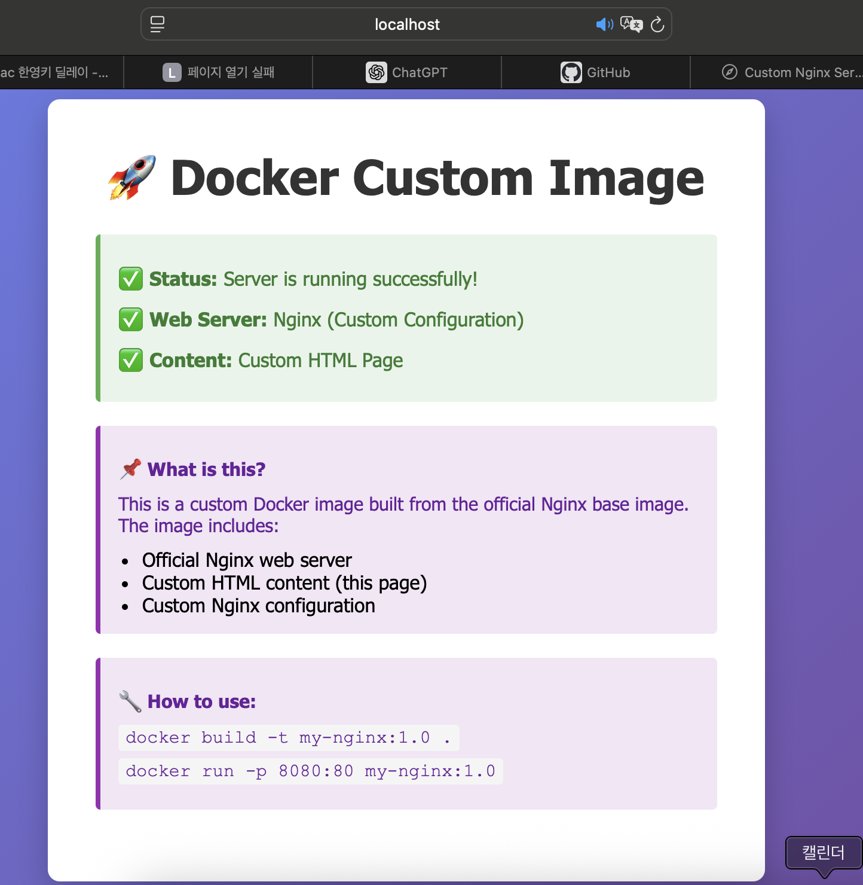

# Problem 6: Dockerfile 기반 웹 서버 컨테이너

그래서: Dockerfile은 무엇인가요?
- 특정 웹 서버를 돌리려면 맞는 의존성을 설치하고, 파이썬 버전 맞추기 위해서 .venv 설치하고 하던 때가 있었지만, 
- 컨테이너 환경에서 그 모든 설치과정을 자동화하고, 환경을 원하는 대로 만드는 명령어를 순서대로 적어둔 레시피 모음집이 바로 Dockerfile이다.


## Dockerfile/이미지 기반의 커스텀 이미지 만들기

(A) 웹서버 베이스 이미지 활용 + 정적 콘텐츠나 설정 교체/ (B)Linux 베이스 이미지 + 기본 기능 추가 중 택일

## A: nginx 활용 + index.html 교체하기 선택!

## Dockerfile
```dockerfile
FROM nginx:latest
## 최신 nginx 이미지를 가져옴. 이미 web 서버가 설치되고 설정된 상태로 시작한다

WORKDIR /usr/share/nginx/html
## 정적 file이 저장될 경로 설정
## Nginx는 이 디렉토리의 파일을 웹으로 제공함


RUN rm -f usr/share/nginx/html/index.html
## 원래 설치되는 정적 index.html을 삭제한다.
## 커스텀 index 파일로 교체하기 위함.

COPY index.html /usr/share/nginx/html/
COPY nginx.conf /etc/nginx/nginx.conf
## 파일 복사하기: HOST의 파일을 컨테이너로 복사한다.
## 커스텀 HTML과 일정을 image에 포함한다.

EXPOSE 80
## 컨테이너의 80번 포트 노출. 실제로 열지는 않고 문서화 역할을 한다.


CMD ["nginx", "-g", "daemon off;"] 
## 컨테이너 시작 시 Nginx 실행 / 옵션으로 컨테이너가 종료되지 않도록 foreground에서 실행됨

```

## 빌드 / 실행 명령 및 결과 로그 (Terminal 스크린샷 가능)

우선 명령어를 통해서 빌드해 봄

```bash
ersatzvitamin9579@c4r3s1 Phase_6_Dockerfile Custom Build % cd Docker_practice_nginx 
ersatzvitamin9579@c4r3s1 Docker_practice_nginx % docker build -t my-custom-nginx:1.0 .
[+] Building 9.6s (10/10) FINISHED                                        docker:orbstack
 => [internal] load build definition from Dockerfile                                 0.2s
 => => transferring dockerfile: 921B                                                 0.0s
 => [internal] load metadata for docker.io/library/nginx:latest                      2.7s
 => [internal] load .dockerignore                                                    0.2s
 => => transferring context: 125B                                                    0.0s
 => [1/5] FROM docker.io/library/nginx:latest@sha256:7150b3a39203cb5bee612ff4a9d187  4.4s
 => => resolve docker.io/library/nginx:latest@sha256:7150b3a39203cb5bee612ff4a9d187  0.2s
 => => sha256:0cf1d6af5ca72e2ca196afdbdbe26d96f141bd3dc14d70210707c 9.09kB / 9.09kB  0.0s
 => => sha256:ec781dee3f4719c2ca0dd9e73cb1d4ed834ed1a406495eb6e44 29.78MB / 29.78MB  1.0s
 => => sha256:7150b3a39203cb5bee612ff4a9d18774f8c7caf6399d6e8985e 10.23kB / 10.23kB  0.0s
 => => sha256:c3fe1eeae810f4a585961f17339c93f0fb1c7c8d5c02c9181814f 2.29kB / 2.29kB  0.0s
 => => sha256:510ddf6557d618d548b6f7680a84dfa925fea17316d335264eb3f0928 626B / 626B  1.0s
 => => sha256:bb3d0aa29654655a18d97605cd63947d39ca5166d44c3341acc 33.16MB / 33.16MB  1.2s
 => => sha256:cde7a05ae42831ee510e8948b80b25c297a1080875a3479c55a65f1e6 955B / 955B  1.5s
 => => extracting sha256:ec781dee3f4719c2ca0dd9e73cb1d4ed834ed1a406495eb6e44b6dfaad  1.1s
 => => sha256:587e3d84dbb5b5fc406b2b292318c9a446e72c144ad849b5ef8755f50 402B / 402B  1.6s
 => => sha256:3189680c601f46244f1706d0d197ddb415d9bb754236c042acffc 1.21kB / 1.21kB  1.8s
 => => sha256:5e815e07e5699b40479214a6a2a30d647495d99cd0f253ee82f52 1.40kB / 1.40kB  2.1s
 => => extracting sha256:bb3d0aa29654655a18d97605cd63947d39ca5166d44c3341acc1bbc8d1  0.7s
 => => extracting sha256:510ddf6557d618d548b6f7680a84dfa925fea17316d335264eb3f09284  0.0s
 => => extracting sha256:cde7a05ae42831ee510e8948b80b25c297a1080875a3479c55a65f1e62  0.0s
 => => extracting sha256:587e3d84dbb5b5fc406b2b292318c9a446e72c144ad849b5ef8755f503  0.0s
 => => extracting sha256:3189680c601f46244f1706d0d197ddb415d9bb754236c042acffc76eed  0.0s
 => => extracting sha256:5e815e07e5699b40479214a6a2a30d647495d99cd0f253ee82f528f481  0.0s
 => [internal] load build context                                                    0.2s
 => => transferring context: 4.88kB                                                  0.0s
 => [2/5] WORKDIR /usr/share/nginx/html                                              0.5s
 => [3/5] RUN rm -f usr/share/nginx/html/index.html                                  0.4s
 => [4/5] COPY index.html /usr/share/nginx/html/                                     0.2s
 => [5/5] COPY nginx.conf /etc/nginx/nginx.conf                                      0.2s
 => exporting to image                                                               0.4s
 => => exporting layers                                                              0.3s
 => => writing image sha256:62eae356aff97cee097743b620c10d70c5ba98590bd7b452cd82343  0.0s
 => => naming to docker.io/library/my-custom-nginx:1.0  

```

이제 my-custom-nginx:1.0 이미비를 활용,  my-web이라는 이름의 컨테이너를 만들어 보자.
```bash

ersatzvitamin9579@c4r3s1 Docker_practice_nginx % docker run -d -p 8080:80 --name my-web my-custom-nginx:1.0
518e3b4a0dcf1a37077a601488badc9d06548c99fab1e225b336512c5a93702c
ersatzvitamin9579@c4r3s1 Docker_practice_nginx % docker ps
CONTAINER ID   IMAGE                 COMMAND                   CREATED          STATUS             PORTS                                     NAMES
518e3b4a0dcf   my-custom-nginx:1.0   "/docker-entrypoint.…"   10 seconds ago   Up 9 seconds       0.0.0.0:8080->80/tcp, [::]:8080->80/tcp   my-web
87923d3a78e5   busybox               "sh"                      4 hours ago      Up About an hour                                             relaxed_chebyshev
8bd4f3fc96b5   ubuntu                "/bin/bash"               5 hours ago      Up 4 hours         0.0.0.0:8000->80/tcp, [::]:8000->80/tcp   my-container

```
`docker ps` 명령어로 실행 중인 것을 확인할 수 있다..

## 포트 매핑 접속 성공 증거 (스크린샷 또는 로그)
스크린샷을 첨부함.




curl localhost:8000 명령어를 쓰면? 로그를 볼 수 있다.
```bash
ersatzvitamin9579@c4r3s1 Docker_practice_nginx % curl localhost:8080
<!DOCTYPE html>
<html lang="ko">
<head>
    <meta charset="UTF-8">
    <meta name="viewport" content="width=device-width, initial-scale=1.0">
    <title>Custom Nginx Server</title>
    <style>
        * {
            margin: 0;
            padding: 0;
            box-sizing: border-box;
        }
        
        body {
            font-family: 'Segoe UI', Tahoma, Geneva, Verdana, sans-serif;
            background: linear-gradient(135deg, #667eea 0%, #764ba2 100%);
            min-height: 100vh;
            display: flex;
            justify-content: center;
            align-items: center;
        }
        
        .container {
            background: white;
            padding: 40px;
            border-radius: 10px;
            box-shadow: 0 10px 25px rgba(0, 0, 0, 0.2);
            max-width: 600px;
            text-align: center;
        }
        
        h1 {
            color: #333;
            margin-bottom: 20px;
            font-size: 2.5em;
        }
        
        .status {
            background: #e8f5e9;
            border-left: 4px solid #4caf50;
            padding: 15px;
            margin: 20px 0;
            border-radius: 4px;
            text-align: left;
        }
        
        .status p {
            color: #2e7d32;
            margin: 8px 0;
            font-weight: 500;
        }
        
        .info {
            background: #f3e5f5;
            border-left: 4px solid #9c27b0;
            padding: 15px;
            margin: 20px 0;
            border-radius: 4px;
            text-align: left;
        }
        
        .info p {
            color: #6a1b9a;
            margin: 8px 0;
            font-size: 0.95em;
        }
        
        code {
            background: #f5f5f5;
            padding: 2px 6px;
            border-radius: 3px;
            font-family: 'Courier New', monospace;
        }
    </style>
</head>
<body>
    <div class="container">
        <h1>🚀 Docker Custom Image</h1>
        
        <div class="status">
            <p>✅ <strong>Status:</strong> Server is running successfully!</p>
            <p>✅ <strong>Web Server:</strong> Nginx (Custom Configuration)</p>
            <p>✅ <strong>Content:</strong> Custom HTML Page</p>
        </div>
        
        <div class="info">
            <p><strong>📌 What is this?</strong></p>
            <p>This is a custom Docker image built from the official Nginx base image. The image includes:</p>
            <ul style="margin-left: 20px; margin-top: 10px;">
                <li>Official Nginx web server</li>
                <li>Custom HTML content (this page)</li>
                <li>Custom Nginx configuration</li>
            </ul>
        </div>
        
        <div class="info">
            <p><strong>🔧 How to use:</strong></p>
            <p><code>docker build -t my-nginx:1.0 .</code></p>
            <p><code>docker run -p 8080:80 my-nginx:1.0</code></p>
        </div>
    </div>
</body>
</html>
ersatzvitamin9579@c4r3s1 Docker_practice_nginx % 

```
와 같이 커스텀 이미지가 나오는 것을 확인할 수 있다.


